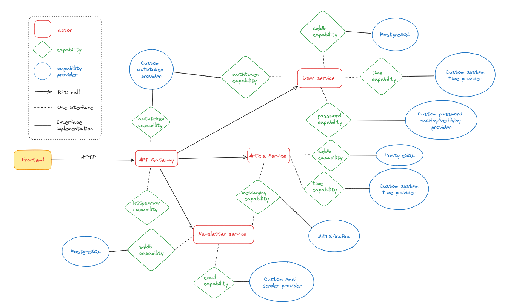

# Medio - a blog publishing platform using server-side WebAssembly with wasmCloud

### Technologies
1. wasmCloud
2. PostgreSQL
3. NATS
4. React

### Architecture


### Run
1. Install [wasmCloud](https://wasmcloud.com/docs/installation) runtime
2. Clone the repository
3. Run 
```
sh dbsetup.sh
wash app deploy wadm.yaml
cd ./medio-frontend
npm run dev
```
4. Visit [`localhost:5173`](http://localhost:5173)

### Blog
https://mesquite-dead-444.notion.site/Building-distributed-application-using-server-side-WebAssembly-and-wasmCloud-c16a3569e2e24e9fb29b2108fc83b04f?pvs=4
